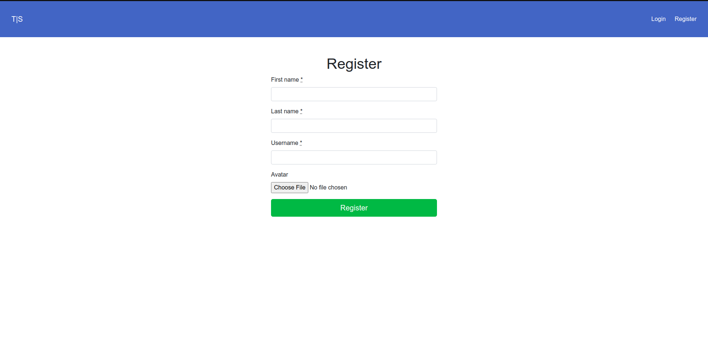
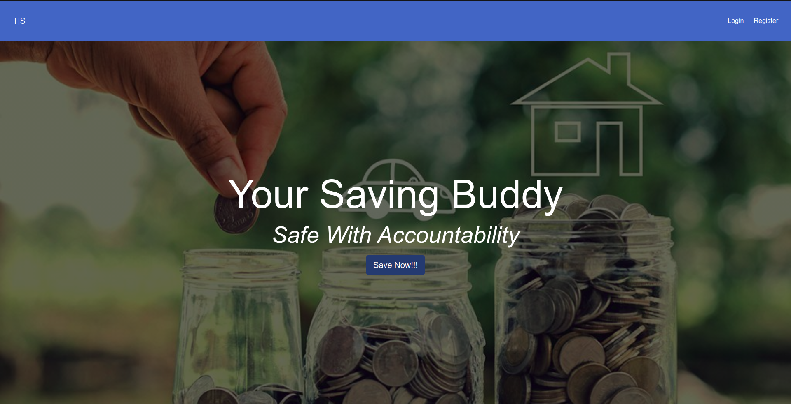

 

# README
Ruby on Rails Capstone Project: Group your expenses

- This is the capstone project of the Microverse Ruby on Rails curriculum. This capstone project is completed as part of the Microverse remote software developement curriculum.

- In this project I created an MVP for tracking expenses. 

## Features

- Users can register and log in to the application

- Users can create a group for expenses

- Users can create a expenses for single and multiple groups

- Users can create a expense without a group

- Users can Invite others into the group

- Invited persons can see the invitation and respond as they please.

### AIM
- Understanding how associations work in rails
- Building a mini authentication system
- Practicing TDD
- Understanding the assest pipeline when deploying apps 

## Live Demo

- [Live Demo Link](https://limitless-coast-23786.herokuapp.com)

## Built With
- Rails
- Ruby,
- HTML
- CSS
- ERB
- Bootstrap
- Rspec

### Prerequisites

- Ruby: 2.7.1 Rails: 6.0.3.2

### Install and Setup

- Clone repo to your local `git clone git@github.com:OlawaleJoseph/team-save.git`
- cd into the cloned repo
- OPen a terminal in the root of the app
- Run `yarn install --check-files`
- Run `bundle install`
- Run `rails db:migrate`
- Run Start up you server with `rails s`
- Open http://localhost:3000/ in your browser.

### Testing
- Open a terminal and run `rspec`.

## Author

👤 **Adedeko Olawale**

- Github: [@OlawaleJoseph](https://github.com/OlawaleJoseph)
- Twitter: [@javanode123](https://twitter.com/javanode123)
- Linkedin: [olawale-adedeko](http://www.linkedin.com/in/olawale-adedeko)

## 🤝 Contributing

Contributions, issues and feature requests are welcome!

Feel free to check the [issues page](https://github.com/OlawaleJoseph/team-save/issues).

## Show your support

Give a ⭐️ if you like this project!

## Acknowledgments

- Microverse
- google
- Stack-overflow
[Design By: Gregoire Vella on Behance](https://www.behance.net/gallery/19759151/Snapscan-iOs-design-and-branding?tracking_source=).

## 📝 License